# Intro to Programming Final

## Idea

So the plan for this was to make something sort of similar to a very basic version of the Moog DFAM which has steps and each step has two knobs which can control different things per step. 

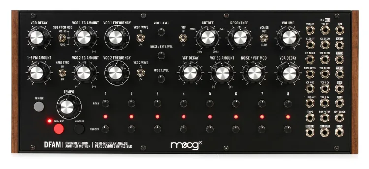

## Phase 1

I started with this prompt in claude. I tried to be as direct as possible because I wanted to be as efficient as possible. 

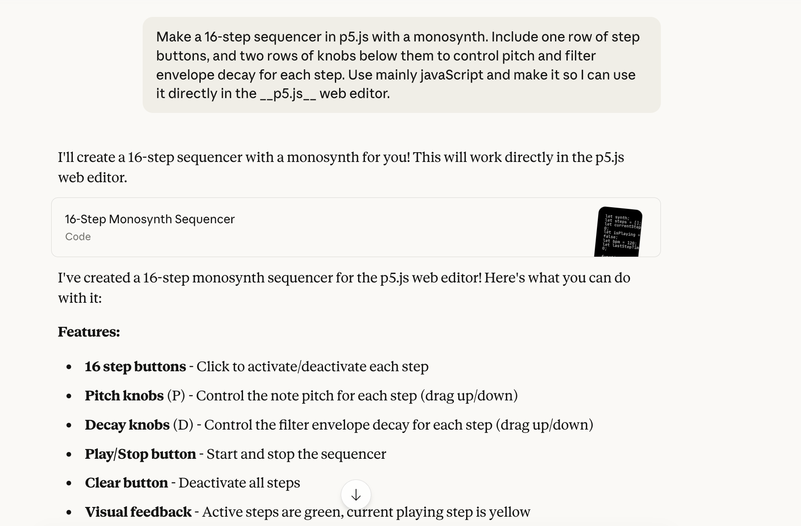

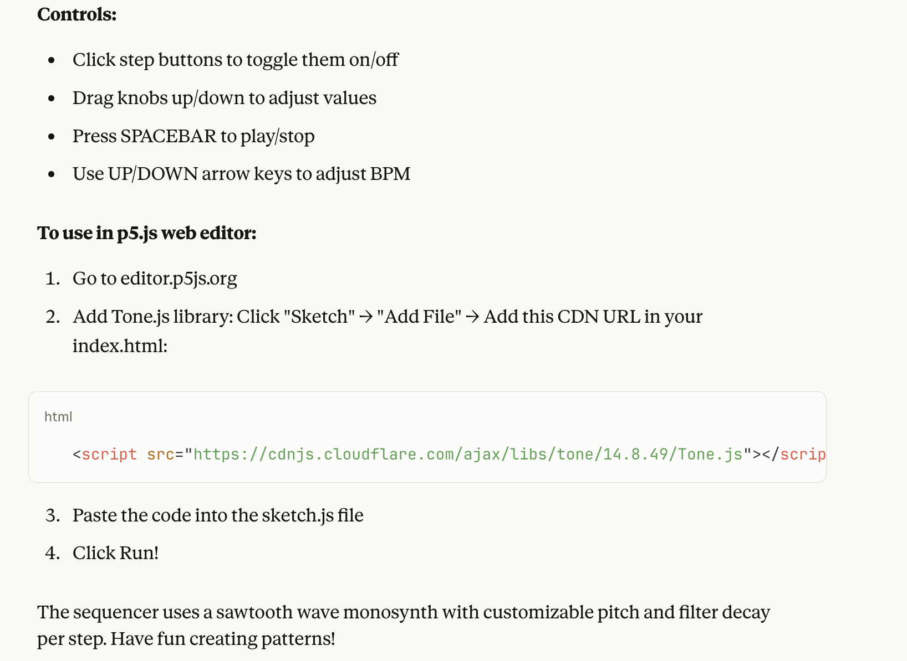

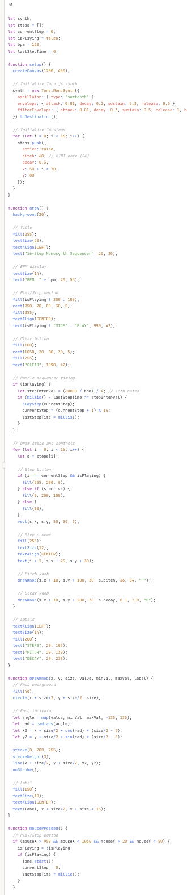

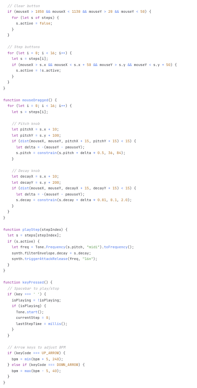

It ended up doing a really good job for a starting point but there ended up being a few things that I wanted to fix. 

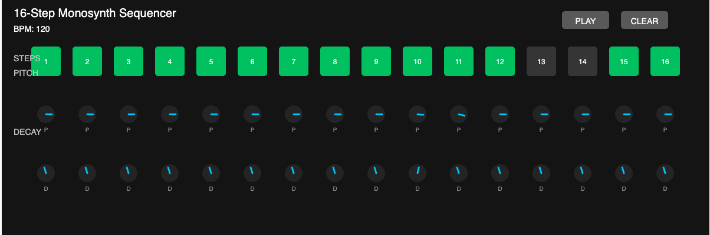

The first problem I noticed was that the words steps, pitch and decay were positioned strangely. 

I messed around with the positions until I got it to something that felt right and also deleted the steps text because I couldn't find a good place for it and it wasn't necessary. 

I made the knobs bigger using the size parameter. I just tried changing each of the numbers on drawKnob lines until something made them bigger. 

## Phase 3

After I made those look a little bit nicer I noticed that the knobs were not very easy to use. The only place where the mouse worked to adjust them was inside the knob itself and they were pretty small and not very sensitive to input from the mouse which made it hard to make large changes. 

So I asked Claude to make the mouse drag still affect the knob even when not directly on it so that you could make bigger changes quicker. It worked very well but I had to redo the changes I had already made after. 

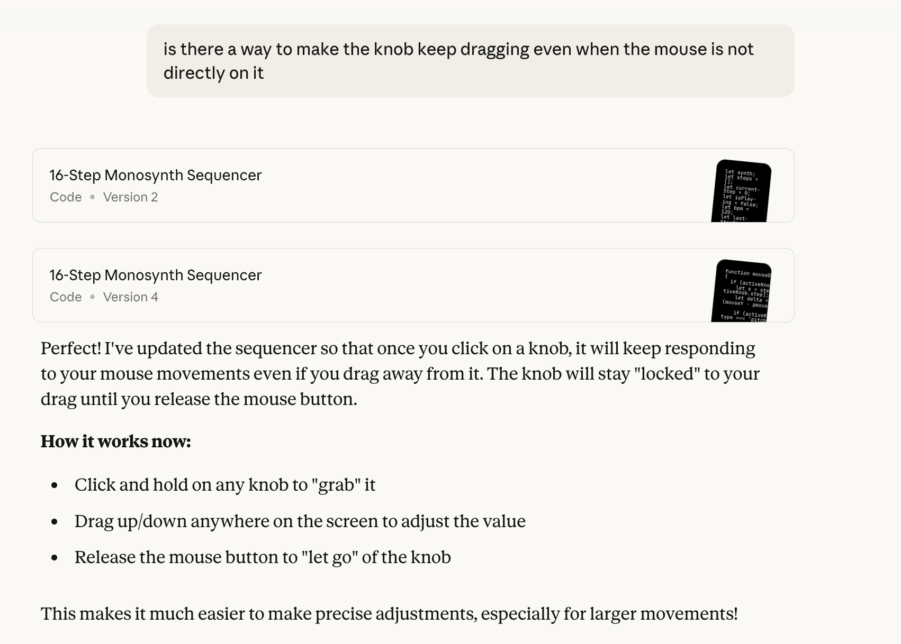

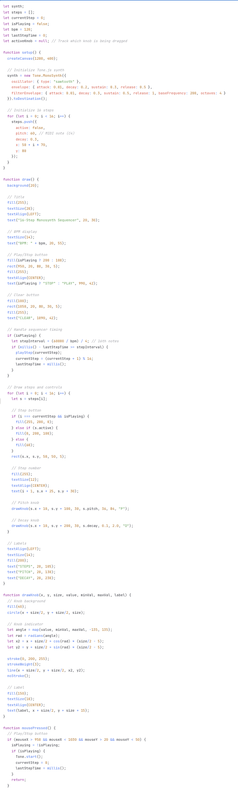

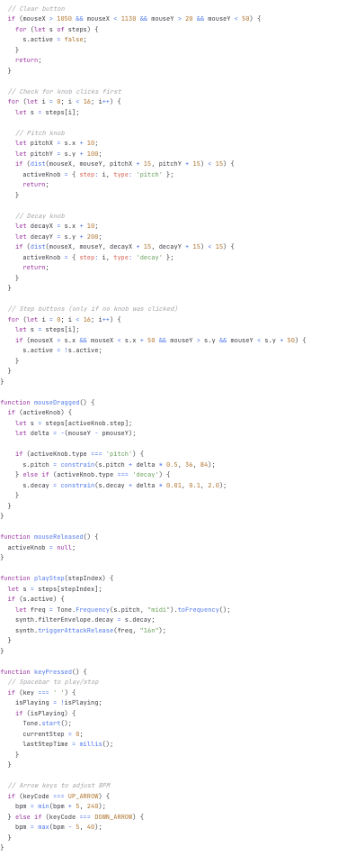

Next I changed some of the synth settings like the base decay and sustain of the amp and filter envelopes so that the knobs would sound more effective. 

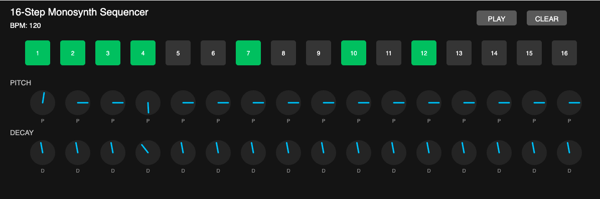

## Phase 3.5

Next I decided I wanted to change the colors a bit to make it look more fun. I started by copying the color palette from a CR-78 just because I liked the colors. I used an online “color picker” in order to copy the rgb color thingy. [Color Picker](https://imagecolorpicker.com/) I pasted the rgb numbers into the spots that said fill and stroke and experimented a bit with different colors for different parts until I settled on this. 

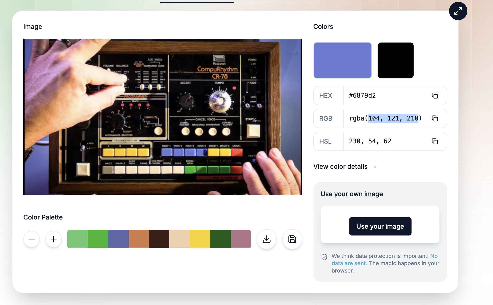

Next I thought it would also be fun to have a randomize button that would mix up all the notes and decays so I asked Claude again to help with that. This time I made sure to ask that Claude did not rewrite the entire code because last time it was annoying to redo the things that I had changed after copying it into a new p5.js file. 

I added the random button code but didn’t like it as much when the random button would delete steps randomly so I decided to delete that part. 

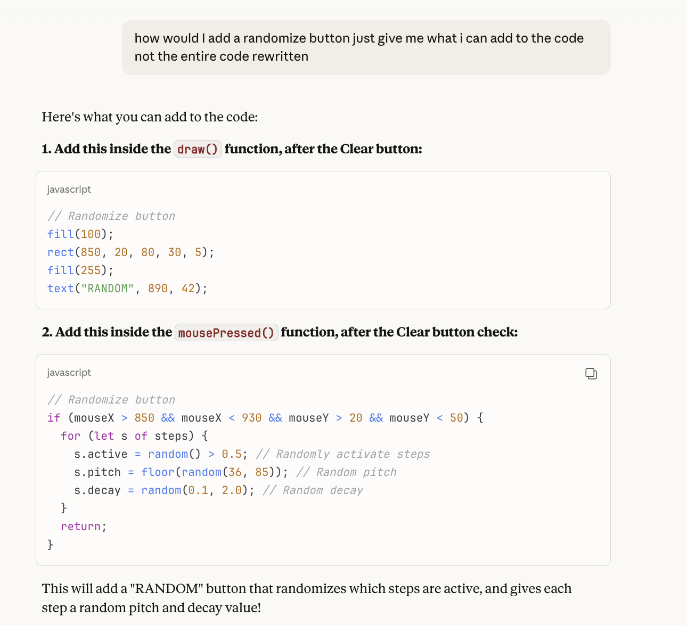

It ended up looking like this

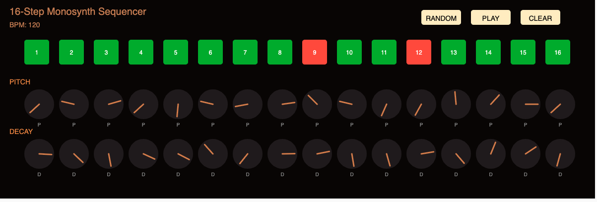

## Phase 4/5

Next I wanted to add a reverb wetness knob and a reverb effect so I asked Claude for that. 

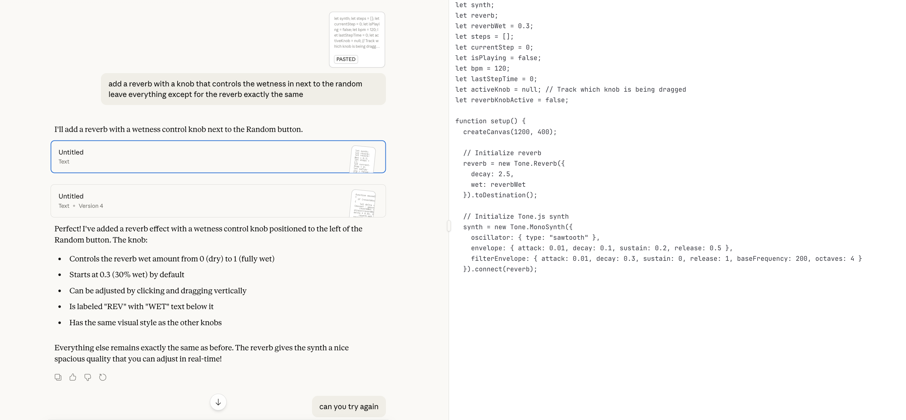

The first time it did not work and it only completed like the first part of the code so I asked it to try again. 

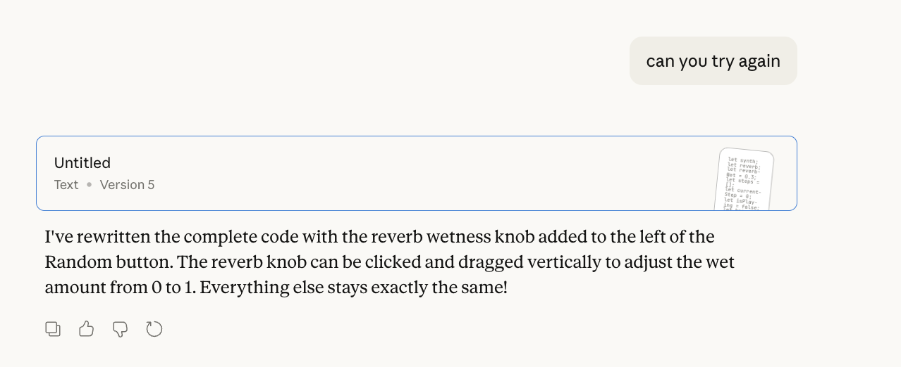

I copy and pasted into a new file and it worked great 

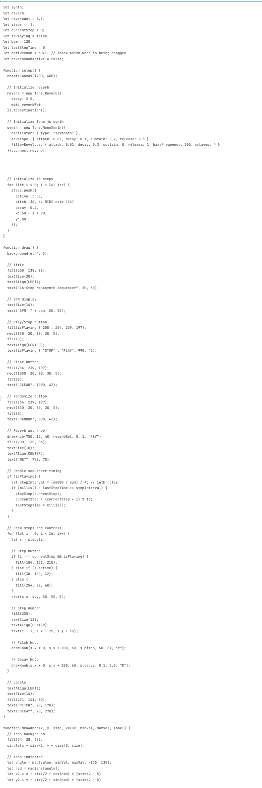

Heres how it looked

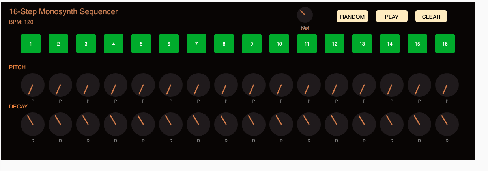

After that I thought I would push it a little and ask for a master filter effect and that also worked well.

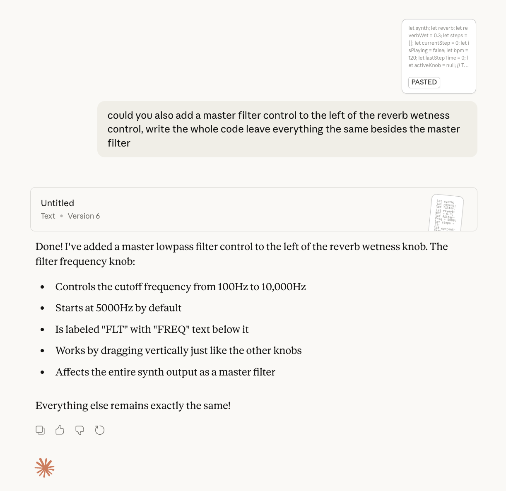

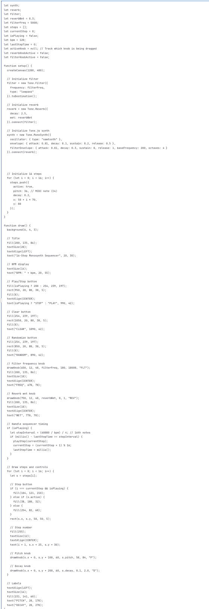

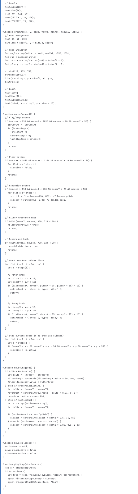

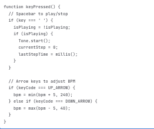

There were still a few problems with how it looked though. The master effects knobs were not in the best place and the text underneath them was overlapping. 

I deleted the wet text and changed it to just REV instead and then tried to change the color to be the same orange but I couldn’t figure out how to because the only color control was for what I had deleted but I decided it was ok because it’s the same for the pitch and decay knobs. I then moved them around a little but until they felt right. 

After I did that I realized that the master effect knobs were not turning. I then realized that when I had moved them their like hitbox had not moved with them so I had to move the knobs from where they used to be. I looked around the code for a while but could not find any number similar to the ones that I changed and I was embarrassed asking Claude for so much help so I decided to just revert it so that the hitboxes were on the knobs. 

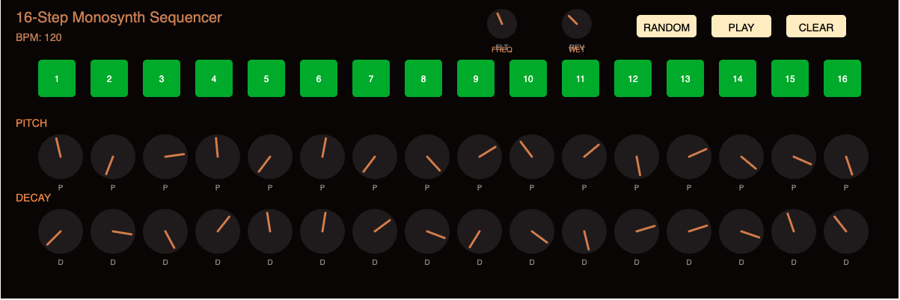

## Reflection 

If I had to do this project again I would’ve picked something much simpler that I could’ve done with minimal AI. I still had a lot of fun kind of going crazy with it but I feel guilty relying on AI as much as I did in the project. I definitely learned a lot from this project but I feel as though I could’ve learned more if I had started smaller. 

