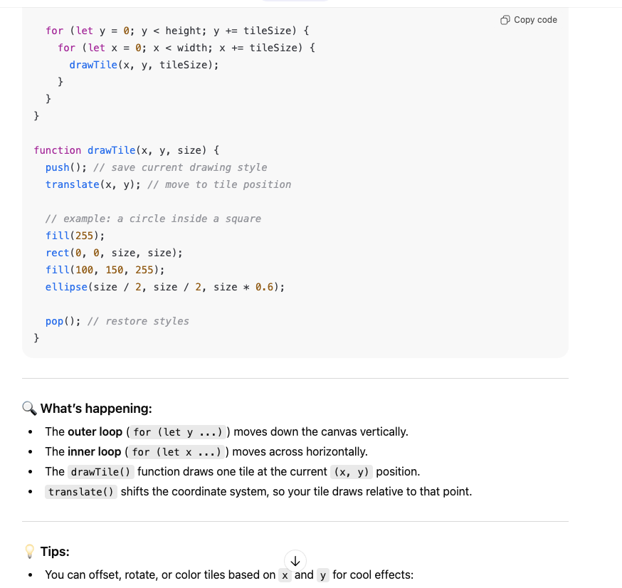
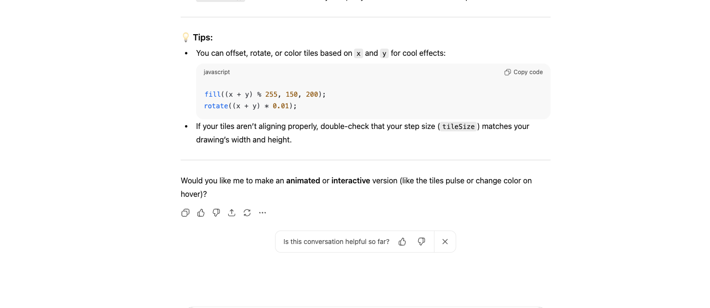

# Documentation File

## Phase 1
I made the drawing and decided to do a sort of stick figure like a simple person made out of rectangles and circles

I originally made the arms long but when I checked in with the professor she said that it would be easier if the arms were shorter so it all fit into the same amount of space and that it would be easier this way 

## Phase 2
Next I started transferring the drawing into p5.js 

Even after reading the instructions it took a little bit of experimenting with the values to get a hang of positioning the shapes right. I counted the blocks in the graph and used the number of blocks to guide the positioning of blocks in p5.js

After that translating was fairly easy I just needed to delete some of the lines I had copied from class like “fill”, and ”noStroke” in order to get just the outline of the shapes and no fill in so that my block figure would work. 

## Phase 3

After that I tried really hard to comprehend the instructions in the assignment and got some of it but not all of it. I copied the code(line 64-85) that was written in the instructions but altered it so that instead of being on top and bottom the drawings were side by side.
function setup() {
  createCanvas(400, 400); // Set the size of canvas
  noStroke(); // Disable drawing the stroke
}

function drawObject(x, y, s) {
  push();
  translate(x, y);
  scale(s);
  fill(0); // Fill in with black color
  rect(40, 10, 60, 10); // Draw rectangles
  rect(40, 10, 5, 50);
  rect(100, 10, 5, 50);
  ellipse(30, 60, 30, 20); // Draw ellipses
  ellipse(90, 60, 30, 20);
  pop();
}

function draw() {
  drawObject(0, 0, 1);
  drawObject(0, 200, 1);
}

## Phase 4

After I got that, I read the next part and tried really hard to understand the instructions and the concepts again for phase 4
At this point I really do not know how to do this. I went back to the code along called 04ControlFlow and found lines 91-115, which I believed might be able to help me because the chessboard thing seems kinda similar to this. 

I have read through the instructions and the code along many times and I have not been making any progress really. I’m not sure I could even pseudo code this. 

Divide the canvas into a grid and figure out size of each cell

For loop through x axis

For loop through y axis

Multiply the cell width with x in for loop to position on x axis 

I cannot comprehend what this means. 

I wrote this based on the chessboard code in the code along but I’m not sure it’s on the right track or really what it means 

let x = 10
let y = 10

for (let y = 0; y = y; y++) {
  for (let x = 0; x = x; x++) {

I know there has to be the multiply the cell width part but I don’t understand how to do that. 

I consulted ChatGPT 

function draw() {
  background(220);
  
  let tileSize = 50; // each tile is 50x50
  
  for (let y = 0; y < height; y += tileSize) {
    for (let x = 0; x < width; x += tileSize) {
      drawTile(x, y, tileSize);
    }
  }
}

I took that code from ChatGPT and tried putting it in the phase 3 sketch and changed the drawTile to drawObject. That didn’t do anything so next I tried putting my drawing into the ChatGPT code. This looked more promising as there were repeats of my drawing but they weren’t spaced correctly because the ChatGPT code was made for a square cell and my cells had to be rectangular. 

Next I got this code function setup() {
  createCanvas(400, 400);

}

function draw() {
  background(220);
  
  let tileHeight = 200; 
  let tileWidth = 80;
  
  for (let y = 0; y < height; y += tileHeight) {
    for (let x = 0; x < width; x += tileWidth) {
      drawObject(x, y, tileHeight * tileWidth);
    }
  }
}

function drawObject(x, y, s) {
  push(); 
  translate(x, y);
  
 
  //head
  ellipse(40, 40, 80, 80);
  
  //eyes
  ellipse(30, 40, 20, 20);
  ellipse(50, 40, 20, 20);
  
  //mouth
  line(30, 60, 50, 60);
  
  //body
  rect(30, 80, 20, 80);
 
  //arms
  rect(0, 90, 30, 20);
  rect(50, 90, 30, 20);
  
  //legs
  rect(0, 160, 30, 40);
  rect(50, 160, 30, 40);
  
  pop(); 
}

I altered the let bindings so that the figures would fit together but I still need to figure out how to scale them when I want to change the size. 

I don't know how I can get any further but at least now I can alter the scale of the drawing and the scale of the cells seperately if I want to. 
